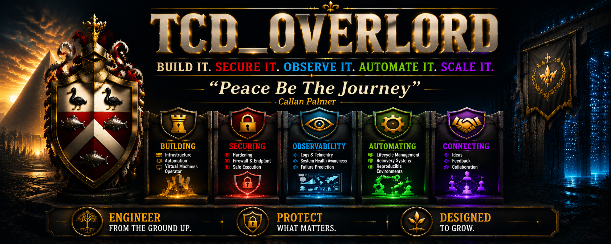

  

🚀 **Building:** Local Infrastructure • PowerShell Automation • Security • Hyper-V Systems

🤝 **Connect:** Ideas • Feedback • Collaboration

---

<table align="center">
<tr>
<th align="center">🚀 Featured Work</th>
<th align="center">🧱 System Architecture</th>
<th align="center">🔐 Security & Reliability</th>
</tr>

<tr>

<td align="center" valign="top">

🖥️ Hyper-V Backup Bootstrap System  
🛡️ Windows Security Hardening Toolkit  
🎥 OBS Safe Launch Utility  
🧰 Windows Maintenance Automation Suite  
🔄 VM Recovery Lifecycle System  
🌐 CIDR Block Calculator  

</td>

<td align="center" valign="top">

🧠 Local-first infrastructure design  
🖥️ Hyper-V VM lifecycle management  
⚙️ PowerShell automation systems  
📦 System bootstrapping & recovery  
🧩 Reproducible environments  
🏗️ Windows infrastructure architecture  

</td>

<td align="center" valign="top">

🔐 Windows hardening systems  
🛑 Firewall + endpoint control  
📡 Monitoring & alerting design  
🧯 Backup + rollback systems  
🧪 Safe execution environments  
🛡️ Defensive engineering  

</td>

</tr>
</table>

---

### ⚙️ Build Local • 🔐 Secure Systems • ☁️ Scale Later

