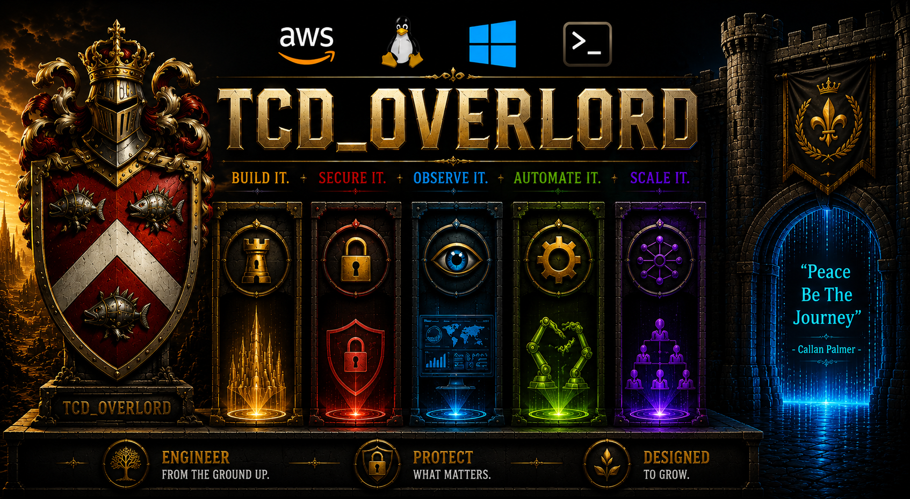

  

---

## 🛡️ TCD_OVERLORD — CLOUD • DEVOPS • SYSTEMS ENGINEERING

### AWS Certified • Full-Stack Engineer • Automation & Infrastructure Builder

---

# 🧠 CORE ENGINEERING PHILOSOPHY

> ### “If I have to do it twice, I turn it into a system.”

I design and build **end-to-end engineering systems** spanning cloud infrastructure, backend services, automation pipelines, and Linux-based environments.

My focus is:
- system reliability
- deployment automation
- scalable architecture
- real-world infrastructure design

---

# 🚀 ENGINEERING EXPERIENCE (REAL SYSTEMS BUILT)

---

## 🌐 Full-Stack Web Systems
- Multi-page web applications (users, messaging, forms, dashboards)
- Modular frontend architecture (HTML / CSS / JavaScript)
- UI systems with reusable components and structured layouts
- Deployed web applications on AWS EC2 environments

---

## ☁️ AWS Cloud & Infrastructure
- EC2-based deployment and server management
- IAM authentication and security concepts
- S3 + cloud storage fundamentals
- DynamoDB data modeling and NoSQL structure design
- Cloud architecture planning and system design workflows

---

## 🐳 DevOps & Container Systems
- Docker-based application environments
- Linux VM provisioning and replication
- Reproducible development environments
- Backup and restore system workflows
- Infrastructure portability across machines

---

## 🧱 Backend Engineering
- Node.js + Express API development
- RESTful API architecture design
- Authentication systems (bcrypt security)
- Dockerized backend services
- Server-side routing and logic systems

---

## 🐍 Automation & Data Engineering
- Python-based automation systems
- Selenium web scraping pipelines (eBayCalc)
- CSV / JSON structured data generation
- Browser automation and extraction workflows
- Data processing and transformation systems

---

## 💾 System Recovery & Infrastructure Design
- Linux environment snapshots and backups
- VM restore and recovery workflows
- Portable system architecture design
- Environment replication across machines

---

# 🧪 PROJECT EXPERIENCE

---

### 🌐 EternalEons Web Platform
- AWS EC2 hosted multi-page application
- User systems, messaging, forms, notifications
- Modular frontend architecture and UI systems
- Full-stack web application structure

---

### 🐍 eBayCalc Automation System
- Selenium-based scraping engine
- Extracts structured marketplace data
- CSV + JSON pipeline generation
- Python automation and browser control

---

### 🐳 Linux / Docker / VM Systems
- Full environment backup and restore systems
- Docker container experimentation
- Linux VM development and testing environments
- Reproducible infrastructure setup workflows

---

### ⚙️ Node.js Backend Systems (Habit Tracker)
- Express API backend system
- Authentication using bcrypt
- Dockerized backend deployment
- REST API service architecture

---

# 💼 PROFESSIONAL SUMMARY

AWS-certified systems engineer with hands-on experience across:

- Cloud infrastructure (AWS EC2, IAM, S3, DynamoDB)
- Full-stack web development
- DevOps and containerization (Docker + Linux)
- Backend API development (Node.js / Express)
- Automation and scraping systems (Python + Selenium)
- System design and infrastructure architecture

Focused on building **deployable, maintainable, and automated systems across cloud and local environments.**

---

# 🚀 ONE-LINE SUMMARY

**TCD_OVERLORD is a cloud and systems engineering portfolio focused on building, deploying, and automating full-stack applications, backend services, and infrastructure systems using AWS, Docker, Linux, and modern engineering practices.**

---

# 🔎 SKILLS TAGS (FOR SEARCH DISCOVERY)

#CloudComputing #AWS #EC2 #IAM #S3 #DynamoDB  
#DevOps #Docker #Linux #SystemAdministration #Infrastructure  
#FullStackDevelopment #WebDevelopment #Frontend #Backend  
#NodeJS #Express #RESTAPI #Authentication #Bcrypt  
#Python #Automation #Selenium #WebScraping #DataEngineering  
#JavaScript #HTML #CSS #UIEngineering  
#Git #GitHub #VersionControl #CI_CD #Deployment  
#VMs #VirtualMachines #SystemDesign #ScalableSystems  
#CloudEngineering #BackendSystems #AutomationEngineering  
#SoftwareEngineering #TechPortfolio #DevOpsEngineering  

---

### ⚙️ BUILD • DEPLOY • AUTOMATE • RECOVER

